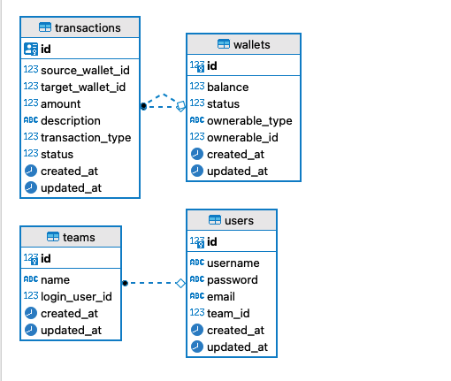

# WALLET DEMO SYSTEM

This README would normally document whatever steps are necessary to get the
application up and running.

UML Design

Things you may want to cover:

* Ruby version: `ruby-3.0.2`

* System dependencies: Redis, Postgresql, 

* Configuration: All at docker-composer file

* Run instructions: just run `sh deploy.sh`, then you can access via `localhost:3000`

* Try around with POSTMAN by the collection provided root of the project

